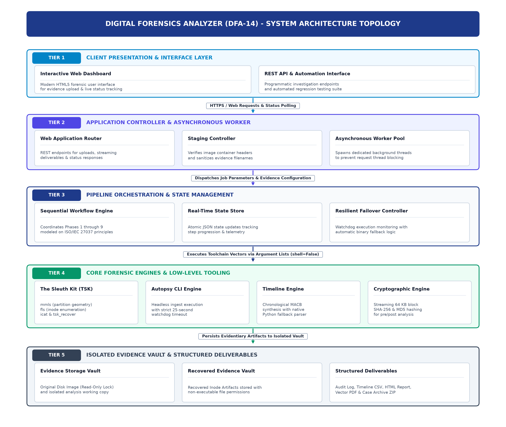
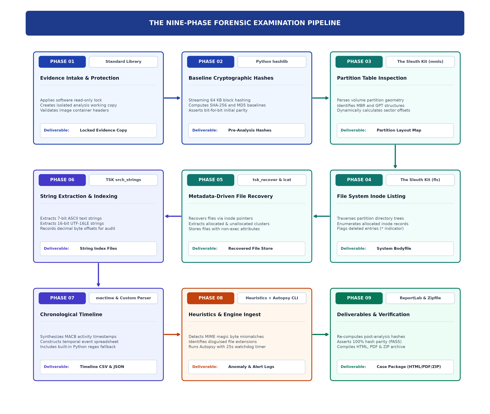
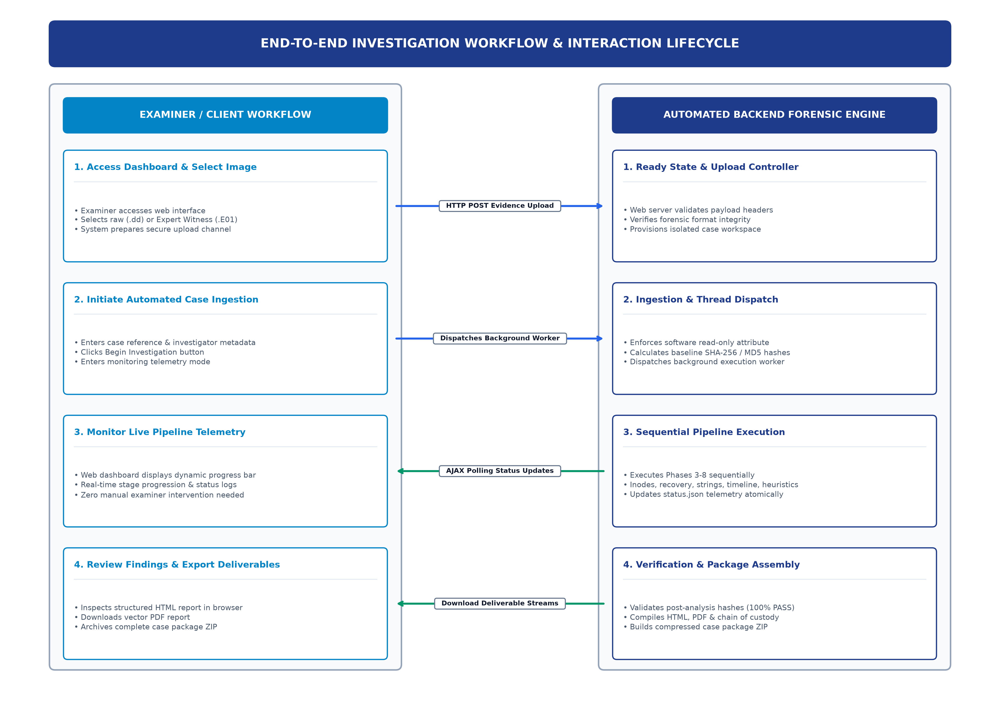

# Digital Forensics Analyzer (DFA-14)
**Automated Forensic Investigation & Reporting Engine**  
*BCSSL Lab 14 (`CASE-TEST-014`) | Modeled on ISO/IEC 27037 Principles*

---

[](https://www.python.org/)
[](https://flask.palletsprojects.com/)
[](https://www.sleuthkit.org/)
[](https://www.autopsy.com/)
[](https://www.microsoft.com/)
[](#8-testing)

---

## 1. Overview

**Digital Forensics Analyzer (DFA-14)** is an automated web-based digital forensics investigation tool designed for BCSSL Lab 14 (Case: `CASE-TEST-014`). 

When a raw bitstream (`.dd`, `.raw`, `.img`, `.001`) or Expert Witness format (`.E01`) disk image is uploaded, the analyzer executes a comprehensive 9-phase forensic examination end-to-end without requiring manual intervention. It enforces evidence integrity with strict read-only protection (software attribute; a hardware or driver-level write blocker would be used on physical evidence), generates structured forensic reports in both HTML and PDF formats, and packages a complete downloadable case archive.

---

## 2. Architecture & Pipeline

### System Architecture Topology


### 9-Phase Examination Pipeline


### Examiner Workflow


---

## 3. Key Forensic Capabilities

| Forensic Phase | Engine / Tool | Capability & Forensic Function |
| :--- | :--- | :--- |
| **1. Evidence Intake & Protection** | Standard Library (`hashlib`, `stat`) | Uploads saved to `jobs/<id>/original/` and set to strictly READ-ONLY via read-only protection (software attribute; a hardware write blocker is used for live physical disks). Baseline SHA-256 computed. Working copy verified in `jobs/<id>/working/`. |
| **2. Chain of Custody & Audit Trail** | Built-in Custody Logger | Generates `chain_of_custody.txt` and `actions_log.txt` with UTC timestamps, examiner details, storage paths, and chronological audit entries modeled on ISO/IEC 27037 principles. |
| **3. Partition & Filesystem Parsing** | TSK `mmls`, `fsstat` | Parses GPT and MBR partition tables. Extracts sector offsets, volume labels, serial numbers, block sizes, and filesystem architectures (FAT12/16/32, NTFS, EXT). |
| **4. File Listing & Inode Enumeration** | TSK `fls -r` | Recursively enumerates active and deleted file records. Identifies unallocated directory entries flagged with `*` and outputs structured `file_listing.json`. |
| **5. File Recovery & Deception Detection** | TSK `tsk_recover -e`, `icat`, Magic Engine | Recovers unallocated file data via volume-level metadata extraction (`tsk_recover`) and targeted inode extraction (`icat`) into non-executable storage `jobs/<id>/recovered/`. Computes SHA-256 for recovered files and flags disguised file extensions via magic byte inspection. |
| **6. MACB Activity Timeline** | TSK `fls -m`, `mactime.pl` (Perl) | Compiles standard Sleuth Kit body file into an ISO-8601 UTC timeline (`timeline.csv`) using `mactime.pl` via Perl (with an internal Python parser fallback). Computes daily activity distribution rendered as an interactive Chart.js graphic. |
| **7. Forensic Keyword Discovery** | Dual-Layer Binary Scanner | Scans all recovered files and raw disk image sectors (both ASCII and UTF-16LE) for target keywords, logging exact byte offsets and surrounding context snippets into `keyword_hits.json`. |
| **8. Post-Examination Integrity Audit** | Cryptographic Re-Hashing | Re-hashes original and working copies after examination. Compares against acquisition baseline and reports explicit **PASS** or **FAIL** in `integrity.json`. |
| **9. Report Compilation & Deliverables** | Jinja2 & ReportLab | Generates interactive `report.html`, professional `report.pdf`, and bundles `case_package.zip` (containing structured forensic reports, audit logs, hashes, timeline CSV, and recovered files). |

---

## 4. Autopsy Automation & Engine Mode Architecture

The tool is designed to evaluate Autopsy command-line ingest first, with automatic fallback to native Sleuth Kit:

1. **Autopsy Command-Line Ingest**: Inspects `CommandLineOptionProcessor` flags (`--createCase`, `--caseName`, `--caseBaseDir`, `--addDataSource`, `--dataSourcePath`, `--runIngest`, `--generateReports`).
2. **Observed Test Result & Fallback**: In automated testing on Windows, invoking `autopsy64.exe` headlessly timed out after 25 seconds (`AUTOPSY_TIMEOUT_SECONDS = 25` in `config.py`) without producing an HTML report, as Autopsy command-line ingest requires an interactive desktop session and pre-configured GUI ingest/report profiles. Consequently, the pipeline seamlessly falls back to **The Sleuth Kit (TSK) Native Pipeline**, which reliably completes all analysis phases in seconds. If Autopsy produces an HTML report within the timeout window, the analyzer archives and presents it directly.
3. **Attribution**: The final structured report explicitly documents which engine mode was utilized (`Autopsy Command-Line Ingest Engine` vs `The Sleuth Kit (TSK) Native Pipeline`).

---

## 5. Safety & Operational Security (OpSec)

- **Untrusted File Quarantine**: Recovered files may contain malicious payloads or weaponized binaries. All recovered files are strictly treated as passive evidence data: they are never executed and are stored in `jobs/<job_id>/recovered/` with execution permissions removed (`stat.S_IREAD | stat.S_IWRITE`).
- **Windows Defender Advisory**: Windows Defender may quarantine test artifacts or recovered evidence. Add a folder exclusion in PowerShell if analyzing known test samples:
  ```powershell
  Add-MpPreference -ExclusionPath "<path-to-repo>\jobs"
  ```
- **XSS & Injection Protection**: HTML templates utilize strict Jinja2 autoescaping (`select_autoescape(['html', 'xml'])`). Dynamic data strings interpolated into ReportLab PDF flowables are sanitized with XML escaping (`xml.sax.saxutils.escape`).
- **Localhost Binding**: The Flask application binds strictly to the loopback interface `127.0.0.1:5000` (`host="127.0.0.1"`), preventing unauthorized network exposure.
- **Upload Size Limit**: HTTP evidence uploads are constrained to 10 GB (`MAX_CONTENT_LENGTH = 10 * 1024 * 1024 * 1024` in `config.py`) to prevent denial-of-service storage exhaustion.
- **Subprocess Safety**: External forensic utilities (`mmls`, `fls`, `fsstat`, `icat`, `tsk_recover`, `mactime.pl`, `attrib`) use strict argument arrays (`shell=False`), preventing command injection.

---

## 6. Directory Structure

```
DFIR-LAB/
├── app.py                      # Flask web application and background worker orchestration
├── config.py                   # Central paths, binary locations, timeouts, and upload limits
├── requirements.txt            # Python dependencies
├── README.md                   # Complete system documentation
├── test_pipeline.py            # Automated end-to-end verification test script
├── test_web_endpoints.py       # Comprehensive Flask HTTP endpoint tests
├── test_e01.py                 # E01 309MB forensic image test runner
├── analyzer/
│   ├── __init__.py
│   ├── intake.py               # Intake, SHA-256 hashing, read-only protection, chain of custody
│   ├── tsk.py                  # mmls partition parsing, fsstat, fls file listing
│   ├── autopsy_cli.py          # Autopsy CLI automation and fallback handler
│   ├── recovery.py             # icat, tsk_recover, magic byte detection, extension mismatch
│   ├── timeline.py             # fls -m bodyfile generator, mactime.pl, timeline CSV & chart
│   ├── keywords.py             # Keyword search across recovered files and raw disk image
│   ├── integrity.py            # Re-hashing evidence verification (PASS/FAIL)
│   └── report.py               # Jinja2 HTML report, ReportLab PDF, and ZIP case packaging
├── templates/
│   ├── upload.html             # Upload dropzone and case metadata form
│   ├── job.html                # Real-time 9-phase progress tracker and live action logger
│   └── report.html             # Interactive forensic laboratory case report
├── static/
│   └── style.css               # Responsive forensic styling and badges
├── docs/
│   ├── 1_Project_Building_Guide.docx
│   ├── 2_Project_Student_Guide.docx
│   ├── 3_Project_Student_Worksheet.docx
│   ├── 4_Project_Student_Worksheet_Solutions.docx
│   ├── final_report_doc.docx
│   └── images/                 # Architecture, pipeline, and workflow diagrams
├── test_images/
│   ├── make_practice_image.py  # Synthetic FAT12 practice disk image generator
│   └── practice_evidence.dd    # 1.44MB test image with deleted files & extension disguise
└── jobs/                       # Runtime storage for examination artifacts (.gitkeep)
```

---

## 7. Installation & Setup

### Prerequisites
- **Windows 10/11** or **Windows Server**
- **Python 3.10+** (tested on Python 3.13)
- **The Sleuth Kit (TSK)** Windows binaries (e.g. `sleuthkit-4.15.0-win32\bin`)
- **Autopsy** (optional, e.g. `Autopsy-4.23.1`)
- **Perl** (in system PATH) for `mactime.pl` (Perl 5.42+ recommended; internal Python fallback available)

### Step 1: Clone the Repository
```powershell
git clone https://github.com/aneeshkumar-ch/DFIR-LAB.git
cd DFIR-LAB
```

### Step 2: Install Python Dependencies
```powershell
python -m pip install -r requirements.txt
```

### Step 3: Configure Forensic Binary Paths
Edit `config.py` to point to your local installation directories:
```python
# The Sleuth Kit (TSK) Configuration
TSK_BIN_DIR = Path(r"D:\sleuthkit-4.15.0-win32\bin")

# Autopsy Configuration
AUTOPSY_DIR = Path(r"D:\Autopsy-4.23.1")
```

### Step 4: Generate Practice Evidence Image
```powershell
python test_images\make_practice_image.py
```
This generates `test_images\practice_evidence.dd` (1.44 MB) containing active files, deliberate deleted files (`FLAG.TXT`, `SECRET.TXT`, `PASSWD.TXT`), and an extension disguise (`DISGUISE.TXT` with PNG magic bytes).

---

## 8. Remote Server & Docker Deployment (Port 888)

The analyzer is fully dockerized and deployed to the forensic server at `/opt/bcssl-teqm/aneesh/DFIR-LAB`:

### Server Access URLs
- **Office LAN**: `http://192.168.0.92:888`
- **Tailscale (Remote)**: `http://100.84.56.125:888`

### Docker Deployment Steps
```bash
# 1. Clone repository into designated workspace
cd /opt/bcssl-teqm/aneesh
git clone https://github.com/aneeshkumar-ch/DFIR-LAB.git
cd DFIR-LAB

# 2. Build and launch container in background
docker compose up -d --build

# 3. Check health and live server logs
docker ps --filter name=dfir-analyzer
docker logs -f dfir-analyzer

# 4. Run end-to-end automated verification inside container
docker exec dfir-analyzer python test_pipeline.py
docker exec dfir-analyzer python test_web_endpoints.py
```

All examination evidence and output deliverables (`jobs/`) are persistently mounted to `/opt/bcssl-teqm/aneesh/DFIR-LAB/jobs` on the host filesystem.

---

## 9. Running the Application (Local Workstation)

### Step 1: Start the Dashboard
```powershell
python app.py
```

### Step 2: Access the User Interface
Open your web browser and navigate to:
**`http://127.0.0.1:5000`**

1. Enter **Case Number** (e.g. `CASE-TEST-014`) and **Lead Examiner Name**.
2. Select or drag-and-drop your evidence image (`practice_evidence.dd` or `.E01` file).
3. Enter target keywords (e.g. `secret, password, confidential, flag`).
4. Click **Start Automated Forensic Analysis**.

### Step 3: Monitor Live Execution
The page automatically redirects to `/job/<job_id>`. The dashboard streams real-time execution steps and logs:
- Evidence Intake & SHA-256 Hashing
- Read-Only Attribute Protection
- Partition Parsing & Inode Enumeration
- Deleted File Recovery & Magic Byte Verification
- Timeline Compilation & Integrity Auditing

### Step 4: Download Case Deliverables
Upon completion, the following deliverables are immediately accessible:
- **Interactive Report**: Complete HTML case report with interactive Chart.js timeline and filterable tables.
- **PDF Report**: Formatted ReportLab PDF document modeled on ISO/IEC 27037 principles.
- **Case Package (ZIP)**: Archive bundling reports, logs, hashes, timeline CSV, and recovered evidence.
- **Timeline CSV**: Standard MACB forensic timeline.

---

## 9. Testing & Verification

The suite includes three automated test runners:

### 1. End-to-End Pipeline Verification (`test_pipeline.py`)
```powershell
python test_pipeline.py
```
**Verification Highlights**:
- **Pipeline Status**: `completed` (all 9 steps completed successfully).
- **Deliverables Verified**: `chain_of_custody.txt`, `actions_log.txt`, `hashes.txt`, `file_listing.json`, `timeline.csv`, `keyword_hits.json`, `integrity.json`, `report.html`, `report.pdf`, `case_package.zip` (100% generated).
- **Evidence Integrity**: `PASS` (acquisition SHA-256 matches final evidence hash).
- **Deleted File Recovery**: Successfully extracted deleted files (`FLAG.TXT`, `SECRET.TXT`, `PASSWD.TXT`).
- **Anti-Forensics Deception**: Correctly flagged `DISGUISE.TXT` as a PNG masquerading under a `.txt` extension.

### 2. HTTP Web Endpoints Test (`test_web_endpoints.py`)
```powershell
python test_web_endpoints.py
```
Validates all Flask endpoints (`/`, `/upload`, `/job/<id>`, `/api/job/<id>/status`, `/job/<id>/report`, `/job/<id>/download/*`) returning HTTP `200 OK`.

### 3. Expert Witness E01 Test (`test_e01.py`)
```powershell
python test_e01.py
```
Validates handling of Expert Witness format images (`2020DFImage.E01`, 309 MB NTFS), recovering partition tables, file listings, and confirming cryptographic audit `PASS`.

---

## 10. Deliverables Mapping (BCSSL Lab 14 Rubric)

| Lab Rubric Deliverable | Tool Output Artifact | Location in Case Package |
| :--- | :--- | :--- |
| **1. Forensic Image & Verification Hash Log** | `hashes.txt` & `chain_of_custody.txt` | `jobs/<id>/hashes.txt`<br>`jobs/<id>/chain_of_custody.txt` |
| **2. Python Hash Verification Output (PASS/FAIL)** | `integrity.json` & PDF Report Badge | `jobs/<id>/integrity.json`<br>`jobs/<id>/reports/report.pdf` |
| **3. Deleted File Recovery via TSK** | Recovered Files & `recovered_files.json` | `jobs/<id>/recovered/`<br>`jobs/<id>/recovered_files.json` |
| **4. Anti-Forensics / Deception Detection** | Extension Mismatch Analysis | Highlighted in HTML/PDF reports (`FLAG: Renamed file detected`) |
| **5. MACB Activity Timeline** | `timeline.csv` & Chart.js Activity Graph | `jobs/<id>/timeline.csv`<br>Interactive chart in `report.html` |
| **6. Written Chain-of-Custody Log** | `chain_of_custody.txt` & `actions_log.txt` | `jobs/<id>/chain_of_custody.txt`<br>`jobs/<id>/actions_log.txt` |
| **7. Final Combined Case Report** | `report.html`, `report.pdf`, `case_package.zip` | `jobs/<id>/reports/report.html`<br>`jobs/<id>/reports/report.pdf` |

## 11. Storage Optimization & Retention Policies (Option A)

To operate efficiently in resource-constrained server environments, the system implements **Option A** automated lifecycle management:

### Core Mechanisms
1. **Mechanism 1 (Immediate Working Copy Purge)**:
   - Once all 9 forensic phases, integrity audits, and case deliverables are generated, the engine automatically deletes `working/<image>` and any temporary ingest caches.
   - **Impact**: Reclaims **50%+ disk space** per investigation immediately.
2. **Mechanism 2 (Automated Background TTL Cleaner)**:
   - A daemon thread runs periodically (every 30 minutes) evaluating completed jobs:
     - **After 24 Hours (`RAW_IMAGE_RETENTION_HOURS=24`)**: Safely removes the multi-gigabyte raw uploaded evidence image from `original/`, leaving a `.pruned.txt` marker.
     - **After 72 Hours (`JOB_RETENTION_HOURS=72`)**: Prunes heavy recovered file trees and large case ZIP archives while permanently preserving audit logs (`chain_of_custody.txt`, `actions_log.txt`, `hashes.txt`), reports (`report.html`, `report.pdf`), and timeline CSVs.
3. **Mechanism 3 (Emergency High-Watermark Safeguard)**:
   - Before accepting any upload, `/upload` inspects server free disk space (`shutil.disk_usage`).
   - If available space drops below **1.5 GB (`MIN_FREE_DISK_GB=1.5`)**, an emergency FIFO purge of the oldest raw images is triggered.
   - If available space is still under 500 MB, the upload is rejected gracefully with HTTP `507 Insufficient Storage`.
4. **Mechanism 4 (Manual 1-Click Evidence Purge)**:
   - Investigators can manually purge the raw image anytime using the **"Purge Raw Image"** button on the `/job/<id>` dashboard or via `POST /api/job/<id>/purge-raw-image`.

### Storage Status API
Query server storage health and active retention parameters:
```bash
curl http://<server-ip>:888/api/storage-status
```
Example JSON response:
```json
{
  "status": "healthy",
  "free_gb": 4.72,
  "used_gb": 22.19,
  "total_gb": 28.37,
  "min_free_threshold_gb": 1.5,
  "auto_clean_working_copy": true,
  "raw_image_retention_hours": 24,
  "job_retention_hours": 72
}
```

---

## 12. License & Academic Disclaimer

Developed for academic research and educational forensic laboratory training under **BCSSL Lab 14**. Designed for authorized educational analysis of bitstream forensic disk images.